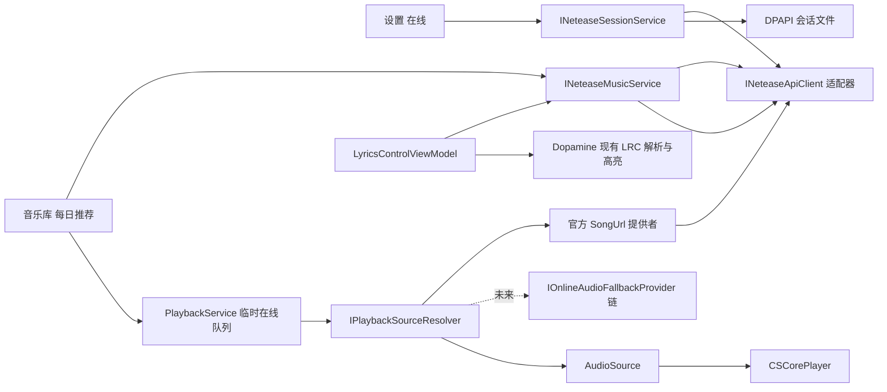

# HyPlayer 网易云核心链路移植设计

日期：2026-07-14

目标仓库：`D:\D-Software\source\dopamine-windows`

参考仓库：`D:\D-Download\第三方网易云\HyPlayer`

参考 API 子模块提交：`d28099727252674823794e33e199cdf0265bf402`

## 1. 结论

本阶段不把整个 HyPlayer 移植到 Dopamine，也不启动本地 Fastify、Node 或远程后端。Dopamine 进程直接调用 HyPlayer 的低层网易云 API 能力，并通过 Dopamine 自己的 Prism、WPF、播放队列和歌词界面完成以下闭环：

```text
设置 → 在线：二维码登录或手动填写 Cookie
→ 音乐库 → 每日推荐：加载账号的每日推荐
→ 双击歌曲或播放全部：按歌曲 ID 懒获取官方播放 URL
→ Dopamine 播放器播放
→ 正在播放 → 歌词：按歌曲 ID 获取并显示逐行歌词
```

UI 的最终落点固定为：

- 在“音乐库”的现有选项卡中，把“每日推荐”追加到“文件夹”右侧。
- 在现有“设置 → 在线”页面顶部增加网易云账号区域。
- 不新增顶层播放器页面，不把网易云登录放进“每日推荐”页面。
- 第一阶段只保留官方播放 URL 提供者；为未来 `UnblockNeteaseMusic` 预留后备提供者接口，但不启动、打包或配置 Unblock。

## 2. 目标

### 2.1 功能目标

- 支持网易云二维码登录。
- 支持粘贴标准 Cookie 请求头格式并登录。
- 登录会话可跨 Dopamine 重启恢复。
- 加载当前账号的每日推荐歌曲。
- 支持双击某首推荐歌曲开始播放。
- 支持“播放全部”，并使用 Dopamine 现有上一首、下一首、暂停、进度和音量控制。
- 播放前按网易云歌曲 ID 获取官方播放 URL。
- 按网易云歌曲 ID 获取 LRC 歌词，并复用 Dopamine 现有逐行解析、高亮和滚动。
- 登录失效、网络故障、无版权、会员限制、试听 URL 和 URL 过期均有可区分的结果和中文提示。
- 本地音乐播放、现有本地队列持久化、Last.fm、Discord 和系统媒体控制不因本功能回归。

### 2.2 工程目标

- HyPlayer API 类型只出现在 `Dopamine.Services` 的适配器内部。
- UI、播放服务和歌词 ViewModel 只依赖 Dopamine 自己的接口与模型。
- 在线歌曲不写入第一阶段的 `Track`、`QueuedTrack` SQLite 表。
- Cookie 不写入 `Settings.xml`，不写日志，不出现在异常消息中。
- 所有新增依赖必须通过 .NET Framework 4.8、旧式 `packages.config`、binding redirect 和 Portable 打包门禁。
- API 或播放器兼容性失败时可以按提交独立回滚。

## 3. 非目标

第一阶段明确不做：

- 搜索、歌单、收藏、红心、评论、私人 FM、云盘、下载管理和账号资料编辑。
- 手机号、邮箱、短信验证码或 WebView 登录。
- 在线歌曲跨重启队列恢复、播放进度恢复或写入 Dopamine 音乐库数据库。
- 把在线歌曲加入 Dopamine 本地播放列表。
- 编辑网易云歌词或把歌词写回不存在的本地音频文件。
- 逐字卡拉 OK、罗马音、翻译歌词合并和歌词分享。
- 在线专辑封面缓存、封面取色和艺术家资料下载；第一阶段在线歌曲使用 Dopamine 默认封面。
- 音质设置 UI；第一阶段使用固定的官方 API 音质级别 `standard`，以减少兼容变量。
- 离线缓存或永久下载；若播放器不能稳定直连 HTTPS，临时音频缓存只作为播放兼容层。
- `UnblockNeteaseMusic` 的进程管理、代理、音源匹配、设置 UI 或打包。
- 部署独立服务器、本地 Fastify 服务或把账号 Cookie 发送到自建中转服务。

## 4. 当前代码事实

### 4.1 Dopamine

- `Dopamine/Dopamine.csproj`、`Dopamine.Services/Dopamine.Services.csproj` 和 `Dopamine.Core/Dopamine.Core.csproj` 均以 .NET Framework 4.8 为目标，使用旧式 MSBuild 项目和 `packages.config`。
- 服务在 `Dopamine/App.xaml.cs` 的 `RegisterTypes` 中以 Prism/DryIoc 单例注册。
- 音乐库选项卡由 `CollectionPage`、`CollectionMenu.xaml`、`CollectionMenuViewModel` 和 `CollectionViewModel` 共同驱动。
- 现有 `CollectionPage` 值为 `Artists=0` 到 `Folders=5`。新项必须追加为 `DailyRecommendations=6`，不能插入中间改变已保存的 `SelectedCollectionPage` 数值。
- 音乐库内容在 `RegionNames.CollectionRegion` 中切换，底部播放控制与频谱由 `Collection.xaml` 统一提供。
- `SettingsOnline.xaml` 已是一个可滚动的纵向设置页，使用 `TitleLabel`、`ProgressRing`、`RegularButton`、`MetroTextBox` 和现有主题画刷。
- `PlaybackService.TryPlayAsync` 当前先执行 `File.Exists(track.Path)`，`CSCorePlayer.GetCodec` 再用 `File.OpenRead` 创建流，因此当前实现不能直接播放 URL。
- `TrackViewModel` 包装数据库 `Track`，`DeepCopy` 会创建新的 ViewModel；新增在线来源信息必须在复制时保留。
- `SaveQueuedTracksAsync` 只保存 `Path`、`SafePath` 和队列标识；恢复时又要求 `File.Exists`，不能直接承载在线歌曲。
- `LyricsControlViewModel.RefreshLyricsAsync` 先按 `track.Path` 读取本地元数据，再读取内嵌歌词、本地 LRC 或第三方歌词提供者；在线歌曲需要在本地元数据读取之前分流。
- `Dopamine.Packager/PackagerConfiguration.xml` 明确枚举 Portable 中的每个 DLL。仅“构建输出里存在 DLL”不足以保证 Portable 产物完整。
- `Dopamine.Tests` 已引用较旧的 `System.Runtime.CompilerServices.Unsafe 4.5.3` 和 `System.Threading.Tasks.Extensions 4.5.4`，而新的 `System.Text.Json` 依赖可能引入版本冲突。

### 4.2 HyPlayer

可复用边界：

- `NeteaseCloudMusicApiHandler` 与 WEAPI/EAPI 请求实现。
- `LoginQrCodeUnikeyApi`、`LoginQrCodeCheckApi` 和 `LoginStatusApi`。
- `RecommendSongsApi`、`SongUrlApi` 和 `LyricApi`。
- API Contract/DTO 与 Cookie 收集机制。
- 播放 URL 懒获取、短期缓存和 `FreeTrialInfo` 判断思路。

不可直接复用：

- HyPlayer 的 UWP 页面、XAML、`ApplicationData.LocalSettings` 和 CommunityToolkit IoC。
- `Windows.Media.Core.MediaSource`、`StorageFile`、`BackgroundDownloader` 和 UWP 播放状态服务。
- HyPlayer 高层 `HyPlayer.NeteaseProvider` 实体、页面导航和播放列表实现。
- HyPlayer 当前明文保存本地 Cookie 的方式。

HyPlayer 的二维码实现使用以下流程：

1. 请求 `LoginQrCodeUnikeyApi` 获得 `unikey`。
2. 本地生成 `https://music.163.com/login?codekey={unikey}` 的二维码。
3. 每 2 秒请求 `LoginQrCodeCheckApi`。
4. 处理状态 `800` 过期、`801` 等待扫码、`802` 等待手机确认、`803` 登录成功。

HyPlayer 的流式提供者把 URL 缓存 20 分钟，并检查响应 `Code`、空 URL 和 `FreeTrialInfo`。Dopamine 保留这一思路，但使用更保守的 15 分钟内存 TTL，并通过自己的播放源解析层接入。

### 4.3 登录风控兼容修订（参考 NeriPlayer）

2026-07-15 的真实日志证明，旧式 Android EAPI 二维码链路会在手机确认后返回 `8821`。该状态表示网易云要求行为安全验证，不能继续作为普通网络错误处理。Dopamine 的登录适配器改为参考 NeriPlayer 的 Web 登录上下文，但仍复用 `HyPlayer.NeteaseApi 0.1.2` 的 WEAPI 加密和响应处理：

- 二维码 key 和轮询使用 WEAPI、`type=1`、`noCheckToken=true`。
- 每个二维码会话生成独立的 52 位十六进制 `sDeviceId`、`NMTID` 和 `v1_{sDeviceId}_web_login_{timestamp}` 格式的 `chainId`。
- 二维码内容使用 `https://music.163.com/st/platform/scanlogin`，携带 `codekey`、`chainId`、`hdw_device=web`、`hdw_appid=web` 和 `hitExp=1`。
- Web 登录请求使用桌面浏览器 UA，并携带 NeriPlayer 已验证的 `Origin`、`x-os: web`、`x-channelsource` 和 `nm-gcore-status` 等公共头；轮询额外携带 `x-loginmethod: QrCode` 和 `x-login-chain-id`。
- `ydDeviceToken` 当前保持可选且默认为空，不为此引入 WebView2 或额外浏览器配置目录。
- `803` 后若响应没有设置 `MUSIC_U`，允许从 `x-refresh-token` 进行一次等价 Cookie 回退，然后仍必须调用账号状态接口验证，不能仅凭 `803` 持久化会话。
- 二维码和手工 Cookie 最终都通过 Web WEAPI `/w/nuser/account/get` 验证；Cookie 上下文补齐 `os=pc` 和 `appver=8.10.35`，但不覆盖用户已经提供的值。
- 传给 `NeteaseCloudMusicApiHandler` 的 `HttpClient` 必须显式关闭自动 Cookie，确保只有受控字典中的候选会话参与请求，避免匿名 Cookie 与手工 Cookie 混用。
- `HyPlayer.NeteaseApi` 默认 JSON 选项只包含包内源码生成类型；创建 Handler 后、第一次请求前必须组合反射元数据回退，否则 Dopamine 自定义 Contract DTO 会在运行时抛出 `NotSupportedException`。
- `8821` 映射为独立的风控错误并显示可操作提示，不伪造登录成功，也不自动清除此前仍有效的会话。

实现和诊断仍遵守原安全边界：不得记录 Cookie 名值、`MUSIC_U`、`unikey`、`sDeviceId`、`NMTID`、`chainId`、完整二维码 URL 或响应正文。日志最多记录登录方法、Cookie 数量、响应码以及响应是否包含 `profile/account`。

## 5. 依赖选择与兼容性门禁

### 5.1 首选方案

首选 NuGet 包：

```text
HyPlayer.NeteaseApi 0.1.2
```

2026-07-14 查询到的包资产：

- `net10.0`
- `netstandard2.0`
- 依赖 `System.Text.Json >= 10.0.3`

`.NETStandard 2.0` 在理论上可由 .NET Framework 4.8 使用，但这不等于当前旧式解决方案、测试工程和 Portable 打包已经兼容。实现前必须先完成独立兼容性提交，检查：

- NuGet restore 是否可重复成功。
- `Dopamine.Services` 是否选择 `netstandard2.0` 资产。
- 主程序和测试工程是否需要统一 `System.Memory`、`Unsafe`、`Tasks.Extensions` 等版本。
- `Dopamine.exe.config` 的 binding redirect 是否完整。
- Release 构建输出是否包含所有传递依赖。
- Portable 暂存目录是否包含所有实际加载的 DLL。
- 在干净 Windows 环境启动时是否出现 `FileNotFoundException`、`FileLoadException` 或版本不匹配。

二维码图像优先使用与 net48 兼容的固定版本 `QRCoder`，二维码必须在本机生成，禁止调用第三方在线二维码服务。QRCoder 版本同样在兼容性提交中锁定并验证。

### 5.2 许可证门禁

HyPlayer 主项目与 Dopamine 均采用 GPLv3，但 `HyPlayer.NeteaseApi` 是独立包，不能仅根据主项目许可证推断其授权。NuGet 0.1.2 的注册元数据当前未提供 `licenseExpression`。

因此实现前必须：

1. 在固定子模块提交中确认 `HyPlayer.NeteaseApi` 的许可证和版权声明。
2. 把确认结果及 QRCoder、System.Text.Json 等新增依赖写入第三方声明或现有许可证清单。
3. 在许可证未确认前，不复制或改写子模块源码进入 Dopamine。

### 5.3 回退方案

仅在 NuGet 方案因绑定、运行或打包问题不可接受时，才评估源码级回退：

- 只抽取所需的 WEAPI/EAPI、Cookie 处理和七个 API Contract。
- 降级到 Dopamine 可编译的 C# 语法。
- 使用仓库已有 Newtonsoft.Json，避免引入整套 System.Text.Json 依赖。
- 保留所有原始版权与许可证声明。
- 回退前必须完成许可证确认；没有明确授权时停止源码复制。

## 6. 总体架构



核心边界：

- `INeteaseApiClient` 是唯一允许引用 `HyPlayer.NeteaseApi.*` 类型的层。
- `INeteaseSessionService` 管登录状态、Cookie 生命周期和 DPAPI 持久化。
- `INeteaseMusicService` 提供每日推荐、官方播放 URL 和歌词的 Dopamine 模型。
- `PlaybackService` 不直接知道 HyPlayer API，只请求通用播放源解析器。
- `CSCorePlayer` 只认识本地文件或远程 URI，不认识网易云歌曲 ID。
- 后备音源提供者位于官方 URL 之后，未来增加 Unblock 时不改每日推荐 UI、队列或歌词流程。

## 7. Dopamine 风格 UI/UX

### 7.1 音乐库选项卡

选项卡顺序固定为：

```text
艺术家 | 风格 | 专辑 | 歌曲 | 播放列表 | 文件夹 | 每日推荐
```

实现约束：

- `DailyRecommendations=6` 追加到 `CollectionPage`。
- `CollectionMenu.xaml` 在“文件夹”后追加 PivotItem。
- `FullPlayerViewModel` 必须先完成 `FullPlayerRegion` 内容导航，再加载对应菜单，避免嵌套 Region 尚未注册时菜单抢先发起子页面导航。
- `CollectionViewModel` 在现有 `CollectionRegion` 导航到各音乐库页面，包括 `CollectionDailyRecommendations`。
- `CollectionMenuViewModel` 读取 `SelectedCollectionPage` 时校验枚举范围；损坏值或功能回滚后遗留的值 `6` 在不支持该页面的版本中必须回退到 `Artists`，不能导航到空白区域。
- 保留顶部现有搜索框；每日推荐列表响应同一个搜索条件，按歌曲名、歌手和专辑过滤，避免出现“搜索框可见但无效”的体验。
- 必须在中文和英文长文本、窗口窄宽度和 100%/150% 缩放下检查 Pivot 是否被搜索框挤压。

### 7.2 每日推荐已加载状态

页面沿用“歌曲”页的紧凑表格，而不是移植 HyPlayer 的卡片首页：

```text
┌──────────────────────────────────────────────────────────────┐
│ 30  首每日推荐                     [刷新]   [播放全部]       │
├──────────────────────────────────────────────────────────────┤
│ 歌曲                     │   │ 艺术家       │ 专辑      │ 时长 │
│ 歌曲 A                   │ ▶ │ 歌手 A       │ 专辑 A    │ 3:42 │
│ 歌曲 B                   │   │ 歌手 B       │ 专辑 B    │ 4:08 │
│ ...                                                          │
└──────────────────────────────────────────────────────────────┘
                 Dopamine 现有底部播放控制与频谱
```

视觉规则：

- 外边距、标题行、字体、主次文字和强调色与 `CollectionTracks.xaml` 对齐。
- 列表使用 `DataGridEx`、虚拟化和 `DataGridRowStyle`。
- 列只保留歌曲、播放指示器、艺术家、专辑和时长。
- 不显示本地文件的评分、红心、播放次数、路径、文件大小、码率和文件操作。
- “刷新”使用现有透明按钮样式；“播放全部”使用 `RegularButtonAccent`，形成一个明确主操作。
- 双击行或在选中行按 Enter：用完整推荐列表建立临时队列，并从该行开始播放。
- “播放全部”：从第一首开始；每日推荐使用独立的播放顺序设置，默认按当前可见列表顺序播放，不继承本地音乐的全局随机状态。
- Ctrl+J 可滚动到当前播放歌曲；不提供 Ctrl+E“在资源管理器中查看”。
- 每日推荐使用专用右键菜单，只保留跳转到播放歌曲、播放选中项、下一曲、添加到当前在线队列和在线搜索；不显示列配置、资源管理器、编辑、删除、磁盘删除、黑名单、本地播放列表和文件信息。
- 已知不可播放的条目可降低不透明度并显示原因 ToolTip；最终播放权限仍由 `SongUrlApi` 结果裁决。

### 7.3 每日推荐页面状态

| 状态 | 表现 | 可用操作 |
| --- | --- | --- |
| 未登录 | 居中显示“请先在 设置 → 在线 登录网易云音乐” | 无播放；用户手动进入设置 |
| 首次加载 | 居中 `ProgressRing`，内容不可点击 | 等待或离开页面取消 |
| 已加载 | 显示表格、数量、刷新和播放全部 | 双击、Enter、播放全部、刷新 |
| 后台刷新 | 保留旧列表，标题行显示小型进度 | 旧列表仍可播放；禁止重复刷新 |
| 空结果 | 显示“今日暂无推荐” | 重试 |
| 网络错误 | 保留旧列表；无旧数据时显示内联错误 | 重试 |
| 会话失效 | 清除账号 UI 状态，显示未登录状态 | 前往设置重新登录 |

首次进入页面时，如果当前日期还没有成功加载过推荐，则自动请求一次；同一天再次进入复用内存结果。手动“刷新”绕过每日列表缓存，但不允许并发重复请求。

### 7.4 设置 → 在线：网易云账号区

网易云区域放在现有“在线搜索提供者”和 Last.fm 区域之前，避免账号登录隐藏在页面底部。

未登录布局：

```text
网易云音乐
登录后可在“音乐库 → 每日推荐”播放账号的每日推荐歌曲。

二维码登录 | Cookie 登录
────────────────────────────────────────────
二维码登录：
  ┌──────────────┐
  │ 本地生成 QR  │  请使用网易云音乐手机 App 扫码
  └──────────────┘  状态：等待扫码 / 等待确认 / 已过期
                    [刷新二维码]

Cookie 登录：
  [••••••••••••••••••••••••••••••••••••••]
  支持从浏览器复制的 name=value; name2=value2 格式
                                         [验证并登录]
```

已登录布局：

```text
网易云音乐
✓ 已登录：昵称
  登录会话已使用当前 Windows 用户凭据加密保存。
                                           [退出登录]
```

交互规则：

- 使用现有 `TitleLabel`、`MenuPivot`、`ProgressRing`、`RegularButton`、`RegularButtonAccent` 和主题画刷，不新建另一套卡片设计语言。
- 二维码固定约 180×180，置于白色内边距容器中，保证深色主题下仍可扫描。
- 页面 Loaded 且未登录时生成一次二维码；页面 Unloaded、切换登录方式、登录成功或退出设置时取消轮询。
- 同一时间只能存在一个 `unikey` 和一个轮询循环。
- 过期后停止轮询并显示“刷新二维码”，不无限自动创建新二维码。
- Cookie 输入使用 `PasswordBox`，不双向绑定到 ViewModel 字符串属性，不提供明文回显。
- 点击“验证并登录”后立即清空输入控件；错误提示不得回显 Cookie 内容。
- 登录中禁用两个登录入口，防止二维码和 Cookie 登录竞争修改同一 Cookie 容器。
- 登录成功只显示昵称或用户 ID，不显示完整 Cookie、CSRF、设备标识或播放 URL。
- 退出登录前显示确认；成功后清除 Cookie、URL 缓存、歌词缓存、每日推荐缓存和加密会话文件。

## 8. Dopamine 内部模型与接口

以下为接口形状草图，不要求逐字照搬命名，但实现必须保持边界。

### 8.1 在线来源标识

```csharp
public enum TrackSourceKind
{
    LocalFile = 0,
    Netease = 1
}

public sealed class TrackSourceInfo
{
    public TrackSourceKind Kind { get; set; }
    public string ProviderId { get; set; }   // "netease"
    public string RemoteId { get; set; }     // 网易云歌曲 ID
    public string ArtworkUrl { get; set; }   // 第一阶段仅保留，不下载
}
```

`TrackViewModel` 增加：

- `SourceInfo`
- `IsLocalFile`
- `IsOnline`
- `SupportsFileMetadataActions`

本地歌曲默认 `LocalFile`。每日推荐映射时创建仅驻内存的合成 `Track`，用 API 元数据填充歌曲名、艺术家、专辑和时长，并使用稳定伪路径：

```text
netease://song/{songId}
```

该伪路径只是队列内身份键，绝不能传给 `File.Exists`、`File.OpenRead`、TagLib、资源管理器或本地元数据仓库。`TrackViewModel.DeepCopy` 必须复制 `SourceInfo`。

### 8.2 API 适配器

```csharp
public interface INeteaseApiClient
{
    Task<NeteaseQrKeyResult> CreateQrKeyAsync(CancellationToken cancellationToken);
    Task<NeteaseQrCheckResult> CheckQrAsync(NeteaseQrSession session, CancellationToken cancellationToken);
    Task<NeteaseLoginStatus> GetLoginStatusAsync(CancellationToken cancellationToken);
    Task<IReadOnlyList<NeteaseRecommendedSong>> GetDailyRecommendationsAsync(CancellationToken cancellationToken);
    Task<NeteaseSongUrlResult> GetSongUrlAsync(string songId, string level, CancellationToken cancellationToken);
    Task<NeteaseLyricResult> GetLyricsAsync(string songId, CancellationToken cancellationToken);
    void ReplaceCookies(IReadOnlyDictionary<string, string> cookies);
    IReadOnlyDictionary<string, string> SnapshotCookies();
    void ClearCookies();
}
```

接口返回 Dopamine DTO，不泄漏 HyPlayer Contract。适配器负责：

- 按 HyPlayer 的实际初始化方式复用一个长期存活的 `HttpClient` 和 `NeteaseCloudMusicApiHandler`，不能为每次请求新建客户端；默认 `AdditionalParameters` 保持库的空默认值，除非固定提交证明某个参数是这七个接口必需的。
- 调用七个所需 API。
- 把 HyPlayer 的错误、响应码和空值映射为 Dopamine 错误。
- 读取和替换 Handler Cookie 容器。
- 对日志和异常执行敏感字段清理。

### 8.3 会话服务

```csharp
public interface INeteaseSessionService
{
    NeteaseSessionState State { get; }
    NeteaseAccountProfile Account { get; }
    event EventHandler SessionChanged;

    Task RestoreAsync(CancellationToken cancellationToken);
    Task<NeteaseQrSession> BeginQrLoginAsync(CancellationToken cancellationToken);
    Task<NeteaseQrState> PollQrLoginAsync(string unikey, CancellationToken cancellationToken);
    Task<NeteaseLoginResult> LoginWithCookieAsync(SecureString cookie, CancellationToken cancellationToken);
    Task LogoutAsync();
}
```

账号状态：

```text
SignedOut
Restoring
SigningIn
SignedIn
OfflineUnknown
Expired
Error
```

`OfflineUnknown` 表示磁盘中有可解密会话，但本次 `/login/status` 因网络故障无法确认。此时不删除 Cookie；每日推荐提示网络错误，而不是误报账号已退出。

### 8.4 网易云业务服务

```csharp
public interface INeteaseMusicService
{
    Task<IReadOnlyList<NeteaseRecommendedSong>> GetDailyRecommendationsAsync(
        CancellationToken cancellationToken);

    Task<NeteaseAudioResolution> ResolveOfficialAudioAsync(
        string songId,
        bool forceRefresh,
        CancellationToken cancellationToken);

    Task<NeteaseLyricResult> GetLyricsAsync(
        string songId,
        CancellationToken cancellationToken);

    void ClearSessionCaches();
}
```

### 8.5 播放源解析

```csharp
public interface IPlaybackSourceResolver
{
    Task<PlaybackSourceResolution> ResolveAsync(
        TrackViewModel track,
        PlaybackSourceRequest request,
        CancellationToken cancellationToken);
}

public sealed class AudioSource
{
    public AudioSourceKind Kind { get; set; } // LocalFile 或 RemoteUri
    public string Location { get; set; }
}
```

本地歌曲解析为 `LocalFile`。网易云歌曲先请求官方 URL，再根据播放器兼容性解析为 `RemoteUri` 或临时缓存文件。

未来后备接口：

```csharp
public interface IOnlineAudioFallbackProvider
{
    string Id { get; }
    int Order { get; }
    bool CanHandle(OnlineAudioFailure failure);
    Task<PlaybackSourceResolution> TryResolveAsync(
        OnlineTrackRequest request,
        OnlineAudioFailure officialFailure,
        CancellationToken cancellationToken);
}
```

第一阶段注册列表为空，或者只注册一个返回“不处理”的 Null Provider。官方解析器不能引用 `UnblockNeteaseMusic`。

## 9. 登录设计

### 9.1 启动恢复

1. `App` 注册 API、会话和音乐服务单例。
2. 会话服务读取 `SettingsClient.ApplicationFolder()` 下的独立会话文件。
3. 用 Windows DPAPI `DataProtectionScope.CurrentUser` 解密。
4. 把 Cookie 写入 API Handler。
5. 请求 Web WEAPI 账号状态接口验证。
6. 成功后进入 `SignedIn`；明确未授权则清理会话；网络失败则进入 `OfflineUnknown` 并保留加密文件。

不得让启动恢复阻塞主窗口。设置页和每日推荐页通过 `SessionChanged` 更新状态。

### 9.2 二维码状态机

| API code | 内部状态 | UI | 行为 |
| --- | --- | --- | --- |
| 801 | WaitingForScan | 请扫描二维码 | 2 秒后继续轮询 |
| 802 | WaitingForConfirm | 请在手机上确认登录 | 2 秒后继续轮询 |
| 803 | Authorized | 正在验证账号 | 停止轮询，调用 LoginStatus |
| 800 | Expired | 二维码已过期 | 停止轮询，等待用户刷新 |
| 8821 | Error | 网易云要求完成安全验证 | 停止轮询，允许稍后重试或改用有效网页 Cookie |
| 其他 | Error | 登录状态异常 | 停止，允许重试 |

轮询要求：

- 间隔 2 秒，不并发叠加请求。
- 每次新建二维码递增 generation；旧 generation 的响应不得更新 UI 或保存 Cookie。
- 页面卸载、切换方法、登录成功和应用退出都取消当前 CTS。
- `803` 后仍必须通过 `LoginStatusApi` 验证，不能仅凭状态码持久化 Cookie。
- QR key、二维码内容和轮询必须来自同一个会话对象，`chainId` 不得在轮询过程中重新生成。

### 9.3 Cookie 登录

接受格式：

```text
MUSIC_U=...; __csrf=...; NMTID=...
```

解析规则：

- 可忽略开头大小写不敏感的 `Cookie:`。
- 以分号拆分段，以第一个等号拆分名称和值，允许值本身含等号。
- 去除名称和值两侧空格。
- 忽略空段，拒绝空名称、控制字符、CR/LF 和超过 32 KiB 的输入。
- 同名 Cookie 使用最后一个值，并在内部诊断中只记录“存在重复名称”，不记录名称对应值。
- 解析后替换而不是叠加旧会话 Cookie，避免两个账号混用。
- 验证前补齐 PC Web 请求所需的 `os` 和 `appver` 默认值，但保留用户显式提供的值。
- 最终以 `LoginStatusApi` 是否返回有效账号为准，不把某一个固定 Cookie 名当作唯一判断条件。
- 验证失败时恢复登录前 Cookie 快照或清空临时候选，不能污染当前有效会话。

## 10. Cookie 和会话安全

会话文件建议：

```text
{SettingsClient.ApplicationFolder()}\Netease\session.dat
```

安全要求：

- Cookie 不进入 `BaseSettings.xml`、`Settings.xml`、命令行、崩溃消息或普通日志。
- 序列化后的明文字节先用 DPAPI `CurrentUser` 加密，再原子写入 `.tmp` 并替换正式文件。
- DPAPI 可附加 Dopamine 固定 entropy；明文字节和 BSTR 使用后尽量清零。
- 会话文件包含格式版本、Cookie 字典和最少账号快照，整体加密。
- 登出删除正式文件和残留临时文件，并清空内存 Cookie。
- 日志最多记录 Cookie 数量、登录方法、状态码类别和错误类型，不记录 Cookie 名值对、二维码 unikey、完整播放 URL或响应正文。
- Portable 目录移动到另一台机器或另一个 Windows 用户后，DPAPI 会故意无法解密；UI 应回到未登录并要求重新登录，不提供可移植明文降级。
- 会话文件损坏或 DPAPI 失败不得导致应用启动崩溃。
- 任何第三方库调试日志必须审计，确认不会输出请求 Cookie Header。

## 11. 每日推荐数据设计

`RecommendSongsApi` 映射的最小字段：

- 歌曲 ID。
- 歌曲名。
- 歌手列表，按 Dopamine 现有多值格式连接。
- 专辑 ID 和专辑名。
- 时长毫秒。
- 封面 URL，仅保留备用。
- 已知权限提示（若 DTO 提供可靠字段）。

缓存规则：

- 推荐日以中国标准时间 06:00 为边界；06:00 前仍属于前一推荐日。
- 内存缓存键包含当前会话 generation 和推荐日。
- 成功结果按原始顺序写入 DPAPI CurrentUser 加密快照，并绑定账号 ID；同一 Windows 用户重启后可复用当日结果。
- 同一推荐日最多发起一次成功的数据请求；页面“刷新”只重新读取当日缓存，失败状态允许重试。
- 页面保持打开时使用一次性计时器跨过 06:00 自动加载；休眠错过计时器时，恢复或重新进入页面也会按新推荐日刷新。
- 登录账号变化会忽略不匹配快照；登出或会话明确失效删除内存与加密推荐缓存。

每日推荐列表映射成带 `TrackSourceInfo(Netease, songId)` 的 `TrackViewModel`。合成 `Track` 不提交到 `ITrackRepository`，也不参与索引。Mapper 必须为现有 `TrackViewModel` 会直接取 `.Value` 的字段提供安全默认值，例如 `TrackNumber=0`，并用测试遍历每日推荐会用到的显示属性，避免在线 DTO 的 nullable 字段在 Now Playing 或排序路径触发异常。

## 12. 队列与持久化边界

第一阶段使用明确的临时在线队列模式：

```csharp
Task<bool> PlayTransientQueueAsync(
    IList<TrackViewModel> tracks,
    TrackViewModel startTrack,
    PlaybackQueueContext context);
```

规则：

- 双击每日推荐或“播放全部”会替换当前运行时队列。
- 队列中的在线歌曲支持上一首、下一首、随机、循环、暂停和进度拖动。
- 在线队列激活时停止 `SaveQueuedTracksAsync` 的持久化计时，不覆盖磁盘中的最后一个本地队列快照。
- 用户随后从本地音乐库开始播放时恢复 Durable 模式，并按现有逻辑保存本地队列。
- 应用在在线队列期间退出，重启后恢复的是最后一次持久化的本地队列，而不是在线队列。
- 第一阶段不支持把本地歌曲和在线歌曲混合到同一持久化队列；每日推荐页面不显示“添加到本地播放列表”等文件型命令。
- `NeteaseDailyRecommendations` 上下文从 `Netease.DailyRecommendationsShuffle` 读取并保存随机状态，默认 `False`；播放器中的随机按钮只修改当前上下文，返回本地 Durable 队列时恢复 `Playback.Shuffle`。
- `Netease.DailyRecommendationsShuffle` 属于可在升级后新增的便携设置，读写必须经过 `SettingDefaults.GetOrAdd` / `SettingDefaults.SetSafe`；旧 `Settings.xml` 缺少整个 `Netease` 命名空间时应自动按 `False` 回填，不能在建立临时队列前因直接 `SettingsClient.Get` 产生空引用。
- 当前在线临时队列允许“下一曲”和“添加到正在播放”，但只能加入在线曲目，不允许混入本地文件或持久化伪路径。
- 在线歌曲不更新本地 `PlayCount`、`SkipCount`、`DateLastPlayed`、评分、红心或文件元数据。
- Last.fm scrobble 和 Discord Rich Presence 可以继续使用在线歌曲已映射的标题、歌手、专辑和时长。

## 13. 播放 URL 与音频输入

### 13.1 官方 URL 解析

1. 以 `songId + level + sessionGeneration` 查 15 分钟内存缓存。
2. 缓存未命中时调用 `SongUrlApi`，第一阶段 `level=standard`。
3. 检查响应对象、首项、code、URL、`FreeTrialInfo`、类型和码率。
4. 对 API 返回的 HTTP URL 优先升级到 HTTPS；禁止把 HTTPS 主动降级成 HTTP。
5. 返回不含敏感 URL 的结构化成功或失败结果。

临时文件兼容播放必须把 HTTP 下载字节进度上报给 `PlaybackService`。现有播放进度控件在主进度条底层显示低透明度缓冲条；缓存命中立即显示 100%，取消、失败、停止或切换到本地歌曲时清零并隐藏。缓冲进度是只读 ViewModel 输出，`ProgressBar.Value` 必须显式使用 `Mode=OneWay`，禁止 WPF 默认绑定模式回写只读属性。该缓冲条表示临时音频准备进度，不宣称边下边播。

URL 缓存失败时只允许一次强制刷新：

- 如果缓存 URL 在打开时失败，清除该项并重新请求一次。
- 新 URL仍失败则停止，不能无限重试或快速跳歌请求。
- 登录、登出或 Cookie 更新会清空全部 URL 缓存。

### 13.2 CSCore 兼容策略

Stage 0 必须实际验证当前 `CSCore.Ffmpeg`：

- HTTPS URL 打开。
- MP3/AAC/FLAC 等实际返回格式。
- 获取总时长。
- Seek。
- 暂停/恢复。
- 自动下一首和取消正在加载的上一首。

若验证稳定：

- `IPlayer.Play` 改接收 `AudioSource`。
- 本地文件继续 `File.OpenRead`，保留特殊字符路径兼容。
- 远程 URI 使用 `FfmpegDecoder(string uri)`，不先执行 `File.Exists`。

若任一关键场景不稳定：

- `NeteasePlaybackSourceResolver` 先把官方 URL 下载到 `Cache\Temporary\Netease` 的 `.part` 文件。
- 下载完成后原子改名，再以本地文件交给现有解码链。
- 临时缓存不是下载功能：最大约 512 MiB、最长 24 小时，启动和退出时尽力清理。
- 下载必须支持取消；取消或失败删除 `.part`。
- 不在 UI 中宣传离线可用。

选择直连还是临时缓存是实现门禁结论，不在第一阶段提供用户设置。

### 13.3 失败分类

- `AuthenticationRequired`
- `SessionExpired`
- `NoCopyright`
- `SubscriptionRequired`
- `TrialOnly`
- `EmptyUrl`
- `NetworkUnavailable`
- `RateLimited`
- `ApiChanged`
- `DecoderUnsupported`
- `TemporaryDownloadFailed`
- `Cancelled`
- `Unknown`

播放失败事件携带分类和本地化消息键。日志可以记录歌曲 ID 和分类，不记录完整 URL 或 Cookie。

## 14. 歌词设计

`LyricsControlViewModel.RefreshLyricsAsync` 的分支顺序改为：

1. 页面和可见性检查。
2. track 为空则清理。
3. 如果 `track.SourceInfo.Kind == Netease`，按 `RemoteId` 调用 `INeteaseMusicService.GetLyricsAsync`。
4. 把原始 LRC 构造成 `new Lyrics(text, "Netease Cloud Music", SourceTypeEnum.Online)`。
5. 交给现有 `LyricsViewModel.SetLyrics`、`ILyricsService.ParseLyrics` 和高亮计时器。
6. 本地歌曲继续执行原来的元数据、旁车 LRC 和在线歌词提供者流程。

规则：

- 歌词按歌曲 ID 缓存 24 小时，缓存仅驻内存；登出时清除。
- 切歌时取消旧请求或至少用 generation 丢弃旧响应，防止 A 歌歌词覆盖 B 歌。
- 第一阶段只显示普通 LRC。翻译、罗马音和逐字歌词字段可保留在 DTO，但不合并显示。
- 无歌词返回 Dopamine 现有“未找到歌词”状态，不视为播放失败。
- 在线歌曲隐藏或禁用“添加歌词”“编辑”“保存到音频文件”。
- 本地歌词编辑行为保持不变。

## 15. 本地文件假设的兼容审计

在线歌曲进入现有播放事件后，下列消费者必须按来源分流，不能只修 `File.Exists`：

| 位置 | 第一阶段在线歌曲行为 |
| --- | --- |
| `PlaybackService` | 使用解析器；跳过本地计数和持久化 |
| `TrackViewModel` | 禁用本地评分、红心和文件元数据写入 |
| `LyricsControlViewModel` | 按 RemoteId 获取歌词 |
| `LyricsViewModel` | 禁用写入音频文件 |
| `CoverArtControlViewModel` | 使用默认封面，不调用本地 MetadataService |
| `PlaybackInfoControlViewModel` | 显示标题/歌手/专辑；隐藏本地评分和红心 |
| `LegacyNotificationService` | 显示文本与默认封面 |
| `NotificationService` | 更新 SMTC 文本；缩略图为空或默认图 |
| `AppearanceService` | 不按在线伪路径提取封面色 |
| `ContextMenuViewModelBase` | 隐藏资源管理器、标签编辑、本地播放列表等文件操作 |
| `BlacklistService` | 第一阶段不把在线歌曲写入本地黑名单 |
| `ScrobblingService` | 允许按标题/歌手正常 scrobble |
| `RichPresenceService` | 允许显示已映射元数据 |

这张表是实现验收范围，不允许把异常全部吞掉后宣称在线播放完成。

## 16. 并发、取消与缓存

### 16.1 请求所有权

- 设置页拥有 QR 登录 CTS。
- 每日推荐 ViewModel 拥有页面加载 CTS。
- `PlaybackService` 拥有当前播放解析 CTS；Stop、下一首、上一首或新选曲取消旧解析。
- `LyricsControlViewModel` 拥有当前歌词 CTS/generation。
- 服务层不得直接更新 WPF 控件，ViewModel 在 Dispatcher 上提交结果。
- 实现时先核对 `HyPlayer.NeteaseApi` 的真实 `RequestAsync` 签名：若底层不接受 `CancellationToken`，Dopamine 只能在调用前后检查取消并用 generation 丢弃迟到结果，不能把这种逻辑描述为已经中止底层 HTTP 请求。

### 16.2 Single-flight

同一会话、歌曲 ID 和音质的并发 URL 请求合并为一个任务；同一歌曲的并发歌词请求也合并。失败任务不能永久留在字典中。

### 16.3 缓存表

| 数据 | 位置 | TTL | 清除条件 |
| --- | --- | --- | --- |
| 每日推荐 | 内存 + DPAPI 文件 | 中国时间 06:00 划分的推荐日 | 登出、明确失效、换账号覆盖 |
| 播放 URL | 内存 | 15 分钟 | 播放打开失败、登出、换账号 |
| 歌词 | 内存 | 24 小时 | 登出、进程退出 |
| 临时音频 | 磁盘，仅兼容回退 | 24 小时/512 MiB | LRU、登出、启动清理 |
| 登录 Cookie | DPAPI 文件 | 直到失效/登出 | 明确失效、登出 |

## 17. API 与 UI 错误映射

| 内部错误 | 每日推荐 UI | 播放 UI | 登录 UI |
| --- | --- | --- | --- |
| AuthenticationRequired | 显示登录提示 | 停止并提示重新登录 | 未登录 |
| SessionExpired | 切换未登录状态 | 清会话并停止 | 登录已失效 |
| NetworkUnavailable | 保留旧列表并允许重试 | 当前歌曲失败，可跳过 | 保留加密会话，显示网络错误 |
| RateLimited | 显示稍后重试 | 不快速重复请求 | 停止 QR 轮询并允许重试 |
| NoCopyright | 行可标记不可播放 | 提示无版权并安全跳过 | 不适用 |
| SubscriptionRequired | 行可标记会员限制 | 提示账号权限不足 | 不适用 |
| TrialOnly | 行可标记仅试听 | 第一阶段不播放试听片段 | 不适用 |
| ApiChanged | 显示服务暂不可用 | 停止并记录结构化诊断 | 显示服务暂不可用 |
| Cancelled | 静默 | 静默 | 静默 |

原始异常只进经过清理的诊断日志。用户提示必须本地化，不显示响应正文、堆栈或 URL。

## 18. 目标文件

### 18.1 预计新增

- `Dopamine.Services/Online/Netease/INeteaseApiClient.cs`
- `Dopamine.Services/Online/Netease/NeteaseApiClient.cs`
- `Dopamine.Services/Online/Netease/INeteaseSessionService.cs`
- `Dopamine.Services/Online/Netease/NeteaseSessionService.cs`
- `Dopamine.Services/Online/Netease/INeteaseSessionStore.cs`
- `Dopamine.Services/Online/Netease/DpapiNeteaseSessionStore.cs`
- `Dopamine.Services/Online/Netease/INeteaseMusicService.cs`
- `Dopamine.Services/Online/Netease/NeteaseMusicService.cs`
- `Dopamine.Services/Online/Netease/NeteaseModels.cs`
- `Dopamine.Services/Online/Netease/NeteaseCookieHeaderParser.cs`
- `Dopamine.Services/Playback/IPlaybackSourceResolver.cs`
- `Dopamine.Services/Playback/PlaybackSourceResolver.cs`
- `Dopamine.Services/Playback/IOnlineAudioFallbackProvider.cs`
- `Dopamine.Services/Playback/NeteasePlaybackSourceResolver.cs`
- `Dopamine.Core/Audio/AudioSource.cs`
- `Dopamine/Views/FullPlayer/Collection/CollectionDailyRecommendations.xaml`
- `Dopamine/Views/FullPlayer/Collection/CollectionDailyRecommendations.xaml.cs`
- `Dopamine/ViewModels/FullPlayer/Collection/CollectionDailyRecommendationsViewModel.cs`
- 对应的 `Dopamine.Tests` 单元测试文件。

### 18.2 预计修改

- `Dopamine/App.xaml.cs`
- `Dopamine/Dopamine.csproj`
- `Dopamine/packages.config`
- `Dopamine.Services/Dopamine.Services.csproj`
- `Dopamine.Services/packages.config`
- `Dopamine.Core/Dopamine.Core.csproj`
- `Dopamine.Tests/Dopamine.Tests.csproj`
- `Dopamine.Tests/packages.config`
- `Dopamine.Packager/PackagerConfiguration.xml`
- `Dopamine/App.config` 与必要的测试/服务配置文件。
- `Dopamine.Core/Enums/PageEnums.cs`
- `Dopamine/Views/FullPlayer/Collection/CollectionMenu.xaml`
- `Dopamine/ViewModels/FullPlayer/Collection/CollectionMenuViewModel.cs`
- `Dopamine/ViewModels/FullPlayer/Collection/CollectionViewModel.cs`
- `Dopamine/Views/FullPlayer/Settings/SettingsOnline.xaml`
- `Dopamine/Views/FullPlayer/Settings/SettingsOnline.xaml.cs`
- `Dopamine/ViewModels/FullPlayer/Settings/SettingsOnlineViewModel.cs`
- `Dopamine.Services/Entities/TrackViewModel.cs`
- `Dopamine.Services/Playback/IPlaybackService.cs`
- `Dopamine.Services/Playback/PlaybackService.cs`
- `Dopamine.Services/Playback/PlaybackFailureReason.cs`
- `Dopamine.Core/Audio/IPlayer.cs`
- `Dopamine.Core/Audio/CSCorePlayer.cs`
- `Dopamine/ViewModels/Common/LyricsControlViewModel.cs`
- `Dopamine/ViewModels/Common/LyricsViewModel.cs`
- `Dopamine/Views/Common/LyricsControl.xaml`
- 本地文件假设审计表中列出的封面、播放信息、通知和外观相关文件。
- `Dopamine/Languages/EN.xml`
- `Dopamine/Languages/ZH-CN.xml`

英语文件必须包含所有新 key，因为 `I18nService` 以英语作为默认 key 集；简体中文提供本阶段完整翻译，其他语言自动回退英语。

## 19. 验证策略

### 19.1 单元测试

- Cookie Header 正常、空段、含等号、重复名称、CRLF 注入、超长输入。
- 日志清理器不会输出 Cookie、unikey 和完整 URL。
- DPAPI 当前用户 round-trip、损坏文件、错误格式版本和登出删除。
- QR 状态码到内部状态的映射。
- 推荐 DTO 到合成 Track/TrackSourceInfo 的映射。
- `TrackViewModel.DeepCopy` 保留在线来源信息。
- URL 空值、code 非 200、试听、会员和无版权映射。
- URL TTL、强制刷新、换账号清缓存和 single-flight。
- 歌词成功、空歌词、旧请求晚到和本地歌词回归。
- 临时队列不触发 SQLite 保存，本地队列仍正常保存。
- 播放源解析器本地/网易云分支和空 fallback chain。

### 19.2 CI/构建验证

- `nuget restore Dopamine.sln -NonInteractive`。
- GitHub Actions `Build Portable` 成功。
- 检查最终 `Dopamine.exe.config` binding redirect。
- 检查 Portable artifact 包含 API、QRCoder 和所有 BCL 依赖。
- 在干净 Windows VM 启动 Portable，确认没有程序集加载错误。

### 19.3 手动运行验证

- 二维码 801→802→803 完整流程、过期、刷新和取消。
- 有效/无效 Cookie、切换账号、退出和重启恢复。
- 断网启动不删除有效会话。
- 每日推荐首次加载、跨重启同日复用、06:00 自动换日、同日手动刷新不重复请求、空结果和失效会话。
- 双击任意行从该行播放；播放全部从第一首播放。
- URL 缓存命中、缓存失效强刷一次、无版权、会员和试听歌曲。
- 播放、暂停、Seek、上一首、下一首、随机、循环和自动下一首。
- 在线下载缓冲条从 0 增长到 100%，缓存命中立即完成，取消/失败/停止后隐藏。
- 普通 LRC 高亮、无歌词、快速连续切歌不串歌词。
- 在线歌曲不出现本地文件编辑/删除/资源管理器操作。
- 本地 MP3/FLAC/WMA 播放、歌词、封面、评分、队列持久化无回归。
- Last.fm、Discord、SMTC、通知和托盘控制在在线歌曲上不崩溃。
- 深色/浅色、中文/英文、窗口缩放和 100%/150% DPI。

真实账号 Cookie 和推荐数据不得进入测试快照、CI secret、构建日志或提交历史。联网集成测试只允许本地手动运行，并默认关闭。

## 20. 验收标准

- “每日推荐”确实位于“文件夹”右侧，且不会改变旧选项卡的持久化数值。
- “设置 → 在线”可完成二维码或 Cookie 登录，并显示明确账号状态。
- 重启 Dopamine 后，同一 Windows 用户可恢复登录；`Settings.xml` 中没有 Cookie。
- 未登录时每日推荐不发起无意义请求，并给出明确入口提示。
- 登录后能加载每日推荐，双击或播放全部能建立临时队列。
- 每日推荐默认顺序播放且随机设置与本地音乐独立持久化；专用右键菜单不暴露任何本地文件操作。
- 每首歌播放前按 ID 懒获取官方 URL，不在推荐加载时批量获取 URL。
- 缓存 URL 打开失败后最多强制刷新一次，不发生无限重试。
- 在线歌曲可播放、暂停、Seek、切歌，并能获取和高亮普通 LRC。
- 在线歌曲不写入本地 Track/QueuedTrack 表，不覆盖最后的本地持久队列。
- 无版权、会员、试听、网络和登录失效能被区分并安全处理。
- 本地文件功能无回归，Portable 产物依赖完整。
- 第一阶段运行时不存在 Fastify、Node 或 Unblock 进程。

## 21. 回滚策略

- 依赖兼容门禁独立提交；失败时先回滚包、binding redirect 和打包清单，不影响 UI。
- API 适配器、会话、UI、队列、播放器和歌词按独立提交实施。
- 每个提交在合入下一层前保持解决方案可构建。
- 如果远程直连不稳定，只回退到临时本地缓存策略，不撤销登录和每日推荐。
- 如果在线队列引发本地持久化回归，关闭每日推荐播放入口，保留登录/API 适配器用于继续诊断。
- 如果第三方 API 发生破坏性变化，UI 显示“服务暂不可用”，不能回退到输出 Cookie 或静默失败。

## 22. 后续 `UnblockNeteaseMusic` 扩展

后续阶段只通过 `IOnlineAudioFallbackProvider` 接入：

```text
官方 SongUrl 成功 → 直接播放，不调用 fallback
官方明确 NoCopyright / EmptyUrl → 按顺序尝试 fallback
登录失效 / 普通网络错误 / 用户取消 → 不调用 fallback
fallback 全部失败 → 返回原始官方失败与后备诊断摘要
```

未来实现还必须单独设计：

- 用户显式启用开关和风险说明。
- Node/Unblock sidecar 的版本锁定、许可证、下载或打包方式。
- 仅监听 loopback、随机端口、健康检查、进程退出和崩溃恢复。
- 不把网易云 Cookie 交给不需要 Cookie 的第三方音源。
- 音源匹配准确性、音质、时长和歌曲版本校验。
- 缓存、代理和系统网络设置隔离。
- 法律、平台条款和地区版权提示。

第一阶段只建立接口和官方提供者，不加入伪实现成功结果，不把 Unblock 失败混入官方链路。
